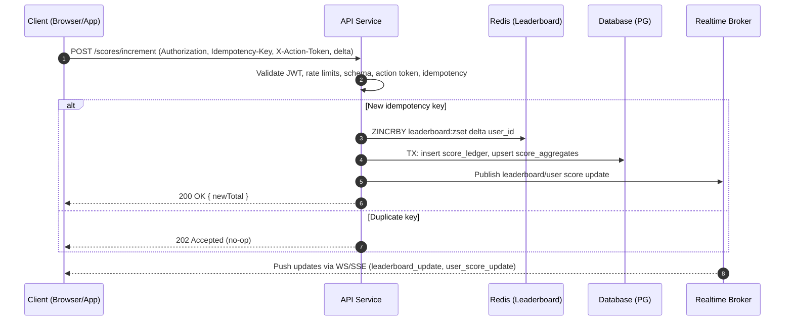

## API Module Specification — Live Scoreboard Service

### Overview

This module powers a real‑time scoreboard showing the top 10 users by score. It accepts trusted score increment requests, persists scores, maintains a fast leaderboard, and streams live updates to connected clients. The design prioritizes security (anti-abuse), low latency for reads, and correctness for score accounting.

### Goals
- Maintain accurate user scores and a top‑10 leaderboard.
- Provide live updates to scoreboard clients with sub‑second latency.
- Prevent unauthorized or automated score inflation.
- Scale to high read fan‑out and moderate write throughput.

### Non‑Goals
- Business logic of the user “action” that earns points.
- Cross‑game or multi‑tenant leaderboards beyond the single global board.


## Architecture

- Source of truth datastore (e.g., PostgreSQL): durable score ledger and user aggregates.
- In‑memory leaderboard (e.g., Redis Sorted Set): fast top‑K reads and atomic increments.
- Real‑time transport: WebSockets (preferred) or Server‑Sent Events for push updates.
- API service: authenticated endpoints for score updates and reads.
- Optional: Background workers for reconciliation, anomaly detection, and backfills.

Data flow:
1) Client completes action → obtains server‑issued token (or action proof).
2) Client calls backend to increment score (authenticated + anti‑abuse checks).
3) Backend atomically increments Redis and writes append-only ledger + aggregate.
4) Backend publishes update → real‑time channel → connected clients update UI.
5) Periodic reconciliation ensures Redis and DB consistency.


## Data Model

- users
  - id (uuid, pk)
  - username (text, unique, indexed)
  - created_at (timestamptz)

- score_aggregates
  - user_id (uuid, pk, fk users.id)
  - total_score (bigint, not null, default 0)
  - updated_at (timestamptz)

- score_ledger
  - id (uuid, pk)
  - user_id (uuid, fk users.id, indexed)
  - delta (int, not null, positive)
  - reason (text, nullable) — e.g., “action:complete”
  - idempotency_key (text, unique, indexed) — dedupe client retries
  - created_at (timestamptz, indexed)

Redis keys:
- leaderboard:zset → ZSET score by user_id
- user:score:{user_id} → STRING cached aggregate (optional)
- idemp:{idempotency_key} → STRING (ttl) to prevent replays


## API Endpoints

All endpoints require HTTPS and Bearer auth (JWT or session token). The API sits behind a WAF and applies per‑user/IP rate limiting.

### POST /scores/increment
Increments the authenticated user’s score.

Request headers:
- Authorization: Bearer <jwt>
- Idempotency-Key: <uuid-v4> (required)
- X-Action-Token: <signed-action-token> (required; see Anti‑Abuse)

Request body:
```json
{
  "delta": 1,
  "reason": "action:complete"
}
```
Constraints:
- delta: integer, 1..10 (configurable upper bound)

Responses:
- 200 OK
```json
{
  "userId": "uuid",
  "newTotal": 1234
}
```
- 202 Accepted — duplicate idempotency (no-op)
- 400 Bad Request — invalid delta/action token
- 401 Unauthorized — missing/invalid auth
- 409 Conflict — action token replayed or expired
- 429 Too Many Requests — rate limit exceeded

Semantics:
- Exactly‑once from client perspective via `Idempotency-Key`.
- Atomic Redis ZINCRBY + durable DB writes in a transaction with outbox/publish.


### GET /scores/top
Returns the top 10 users by score.

Query params:
- limit (optional, default 10, max 50)

Response:
```json
{
  "entries": [
    { "userId": "uuid-1", "score": 2000, "username": "alice" },
    { "userId": "uuid-2", "score": 1999, "username": "bob" }
  ]
}
```

Data source:
- Redis ZSET for low‑latency top‑K.
- On cache miss, rebuild from DB aggregates.


### GET /scores/me
Returns the caller’s current score.

Response:
```json
{ "userId": "uuid", "score": 1234 }
```


### GET /scores/stream (WebSocket) — preferred
Upgrades to a WebSocket that pushes leaderboard diffs and user score updates.

Messages (server → client):
- event: "leaderboard_update"
```json
{
  "event": "leaderboard_update",
  "entries": [
    { "userId": "uuid-1", "score": 2001 },
    { "userId": "uuid-2", "score": 1999 }
  ],
  "version": 42
}
```
- event: "user_score_update"
```json
{
  "event": "user_score_update",
  "userId": "uuid-1",
  "score": 2001,
  "version": 101
}
```

Reconnect/backfill:
- Include monotonically increasing `version` to allow clients to request diffs after reconnect (via `?sinceVersion=x` on initial connect or a separate HTTP endpoint).

Alternative: GET /scores/stream (SSE)
- Same payloads as text/event-stream for environments where WebSockets are unavailable.


## Execution Flow (Sequence)




## Anti‑Abuse and Security

- Authentication: JWT (short‑lived access, rotating refresh) or trusted session.
- Authorization: user may only increment their own score.
- Signed action tokens: short‑TTL, single‑use, server‑issued on legitimate action completion. Include claims: user_id, action_type, issued_at, expires_at, nonce; signed with HMAC or asymmetric keys. Validated server‑side and bound to user/session. Stored replay guard in Redis (`idemp:{nonce}`) with TTL.
- Idempotency keys: per client request to prevent duplicate increments on retries.
- Rate limiting: token bucket per user and IP (e.g., 10 increments/min, configurable). Hard caps per hour/day. Separate budget for burst vs sustained usage.
- Anomaly detection: flag unusually high deltas, frequency outliers, or impossible patterns. Optionally quarantine and require manual review.
- Request integrity: require HTTPS; enforce body size limits; validate schemas strictly.
- Replay protection: bind tokens to user agent fingerprint or device id (optional).
- Audit trail: append‑only ledger with reason and timestamps.


## Consistency, Ordering, and Recovery

- Write path:
  - Atomic sequence: validate → increment Redis → write DB → publish event. If publish fails, an outbox pattern ensures eventual publish.
- Leaderboard correctness:
  - Redis is the serving layer; DB is source of truth. A periodic job reconciles top‑K against DB aggregates and repairs drift.
- Versioning:
  - Every update increments a `version` (Redis counter or DB sequence). Stream uses versions to let clients catch up after reconnects.
- Idempotency:
  - Store idempotency key with result for 24h (configurable). Return last result on duplicate.


## Performance and Scalability

- Reads: Redis ZREVRANGE for top‑K is O(log N + K). Keep K small (≤50).
- Writes: ZINCRBY is O(log N). Batching is optional but not required.
- Real‑time fan‑out: push only diffs or top‑10 snapshots when changed; debounce bursts (e.g., coalesce updates within 100ms).
- Horizontal scaling: stateless API nodes; sticky WS via gateway if needed; Redis cluster for capacity; read replicas for DB.


## Error Handling

- 4xx for client issues (validation, auth, idempotency/replay, rate limit).
- 5xx for server failures; return `retry_after` when appropriate.
- Include stable error codes and correlation IDs in responses and logs.


## Observability

- Metrics: request counts, p95 latency per endpoint, Redis/DB latency, rate‑limit hits, idempotency duplicates, WS connections, publish lag.
- Logs: structured JSON with user_id, idempotency_key, delta, result.
- Tracing: distributed tracing spans across API, Redis, DB, and broker.


## Testing Strategy

- Unit: validation, idempotency logic, token verification, rate limiting.
- Integration: Redis ZINCRBY + DB transaction behaviors and outbox publish.
- E2E: score increments reflect in top‑10 and real‑time stream under load.
- Security: replay attempts, forged tokens, concurrency races.


## Configuration

- SCORE_MAX_DELTA (default: 10)
- IDEMPOTENCY_TTL_SECONDS (default: 86400)
- ACTION_TOKEN_TTL_SECONDS (default: 30)
- RATE_LIMITS: per‑minute/hour caps
- REALTIME_DEBOUNCE_MS (default: 100)


## Migration Plan

1) Create tables (`users`, `score_aggregates`, `score_ledger`).
2) Backfill `score_aggregates` from ledger if historical data exists.
3) Initialize Redis ZSET from aggregates; verify top‑K parity.
4) Deploy increment endpoint behind a feature flag; shadow write to Redis.
5) Enable real‑time updates; monitor publish lag and error rates.
6) Gradually ramp traffic; remove feature flags after SLOs are met.


## API Contracts (Schemas)

- JWT Claims:
```json
{
  "sub": "user-id-uuid",
  "iat": 1731200000,
  "exp": 1731203600
}
```

- Signed Action Token (JWS claims):
```json
{
  "uid": "user-id-uuid",
  "typ": "action:complete",
  "iat": 1731200000,
  "exp": 1731200030,
  "nonce": "uuid-v4"
}
```


## Example Client Integration (high level)

1) On action complete, request a signed action token (or receive it from the trusted action service).
2) Call POST `/scores/increment` with `Idempotency-Key`, `X-Action-Token`, and `delta`.
3) Update local UI optimistically; reconcile with response.
4) Open `/scores/stream` to receive live leaderboard and user score updates.
5) On reconnect, request diffs using last seen `version`.


## Additional Comments and Suggested Improvements

- Historical leaderboards: add daily/weekly/monthly scopes with per‑scope Redis keys and partitioned ledger tables.
- Pagination and search: extend `/scores/top` with `cursor` for stable pagination and filters.
- Batch increments: optional POST `/scores/batchIncrement` for server‑to‑server bulk updates; maintain idempotency per item.
- Privacy: return `username` only if users consent; otherwise show anonymized labels.
- Cheating resistance: device attestation and proof‑of‑work throttles for suspicious clients; server‑measured events where possible.
- Resilience: implement the outbox/inbox pattern for publish/subscribe reliability and deduplication across retries.
- Cost control: expire idempotency keys after 24–48h; tune Redis memory policies.
- Accessibility: include “last updated” timestamp and ARIA live regions for screen readers on the scoreboard UI.
- Multi‑region: for global apps, run regional Redis/DBs with eventual global leaderboard via periodic merge jobs.


## Acceptance Criteria (for Implementation)

- Secure, authenticated increment endpoint with idempotency and action token checks.
- Redis‑backed top‑K with p95 < 50ms for GET `/scores/top` under expected load.
- Real‑time updates delivered within 500ms of accepted increments.
- Auditability: every increment recorded in ledger with idempotency key.
- Operational metrics, logs, and basic dashboards in place.


